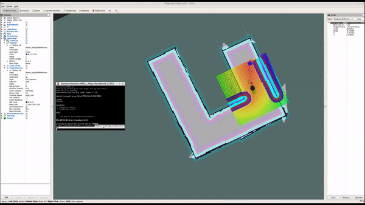

# Home Service Robot

The goal of this project is to build and program a robot which can autonomously map an environment and navigate to pick up virtual object and then drop off them using search algorithm.
 
 

# Project Setup
Update system: `sudo apt-get update`
Install the ROS navigation stack: `sudo apt-get install ros-kinetic-navigation`
Create catkin workspace:
```
$ mkdir -p ~/catkin_ws/src
$ cd ~/catkin_ws/src
$ catkin_init_workspace
$ cd ~/catkin_ws
$ catkin_make
```
Clone the following repositories to catkin_ws/src:
```
$ cd ~/catkin_ws/src
$ git clone https://github.com/ros-perception/slam_gmapping.git
$ git clone https://github.com/turtlebot/turtlebot.git
$ git clone https://github.com/turtlebot/turtlebot_interactions.git
$ git clone https://github.com/turtlebot/turtlebot_simulator.git
Install package dependencies with rosdep install [package-name]
```
Copy content of this repository to catkin_ws/src

Source and build the project:
```
$ cd ~/catkin_ws
$ source devel/setup.bash
$ catkin_make
Run ./home_service.sh in ShellScripts directory to deploy the home service robot.
```
#### ***In this project to simulate a home service robot:***
* Design a simple environment with the `Building Editor` in Gazebo.
* Drive my robot using `turtlebot_pkg` and manually test SLAM `slam_gmapping pkg` using shell script test_slam.sh
* Use the ROS `navigation stack` and manually commands your robot using the 2D Nav Goal arrow in rviz to move to 2 different desired positions and orientations using shell script test_navgation.sh
* Write a `pick_objects` node that commands your robot to move to the desired pickup and drop off zones 
* Write an `add_marker_blinking` node that publish the object to pickup zone and then pause 5 sec and then object appear to drop_off after 5 sec. 
* Write an `add_makers` node that subscribes to your robot odometry, keeps track of your robot pose, and publishes markers to rviz.
* Finally commanded home_service.sh to generate all nodes. 


**Catkin workspace should look something like this:**
```
catkin_ws/src
    ├── slam_gmapping                  # gmapping_demo.launch file                   
    │   ├── gmapping
    │   ├── ...
    ├── turtlebot                      # keyboard_teleop.launch file
    │   ├── turtlebot_teleop
    │   ├── ...
    ├── turtlebot_interactions         # view_navigation.launch file      
    │   ├── turtlebot_rviz_launchers
    │   ├── ...
    ├── turtlebot_simulator            # turtlebot_world.launch file 
    │   ├── turtlebot_gazebo
    │   ├── ...
    ├── World                          # world files
    │   ├── ...
    ├── ShellScripts                   # shell scripts files
    │   ├── ...
    ├──RvizConfig                      # rviz configuration files
    │   ├── ...
    ├──pick_objects                    # pick_objects C++ node
    │   ├── src/pick_objects.cpp
    │   ├── ...
    ├──add_markers                     # add_marker C++ node
    │   ├── src/add_makers.cpp
    │   ├── src/add_marker_blinking.cpp
    └──
```
